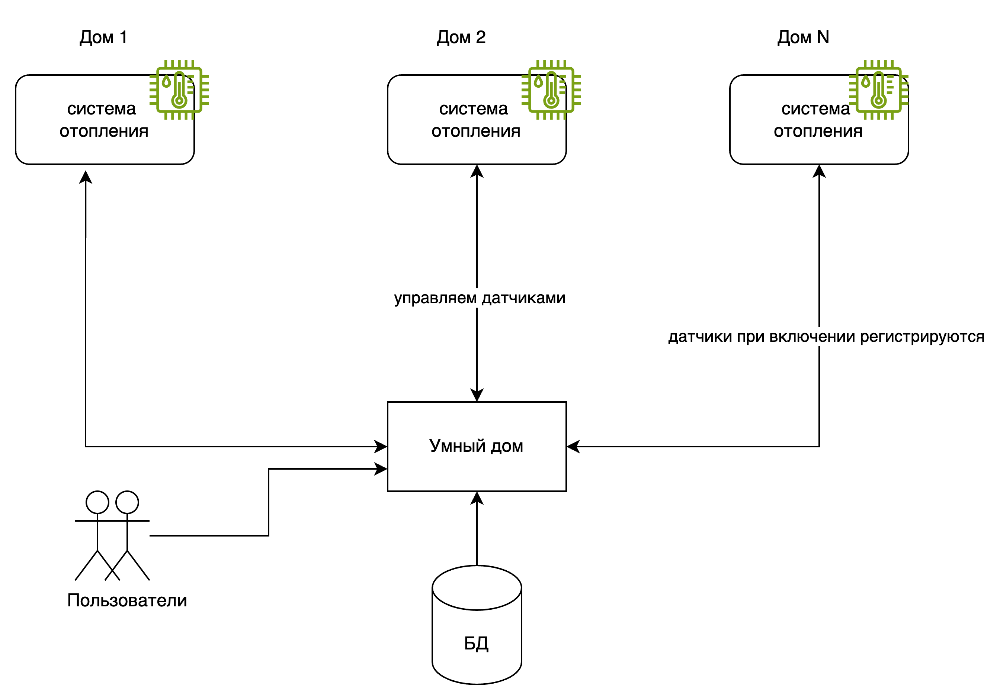
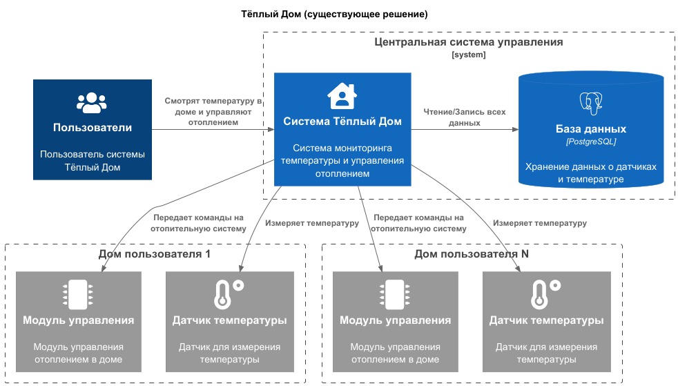
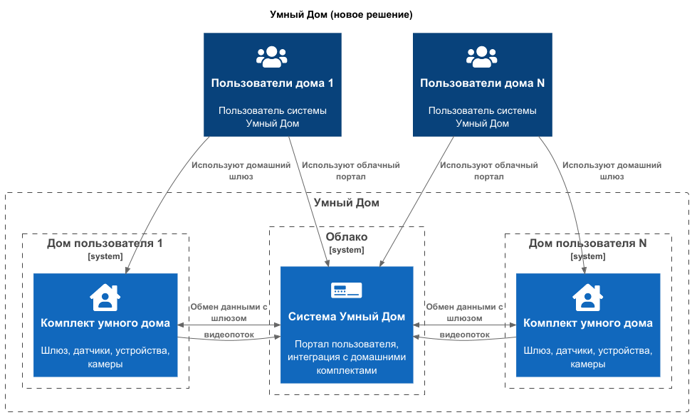
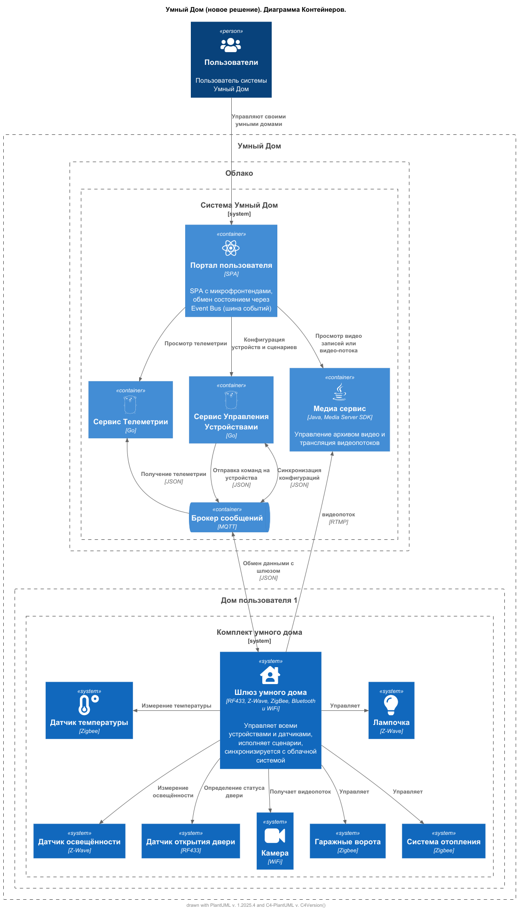
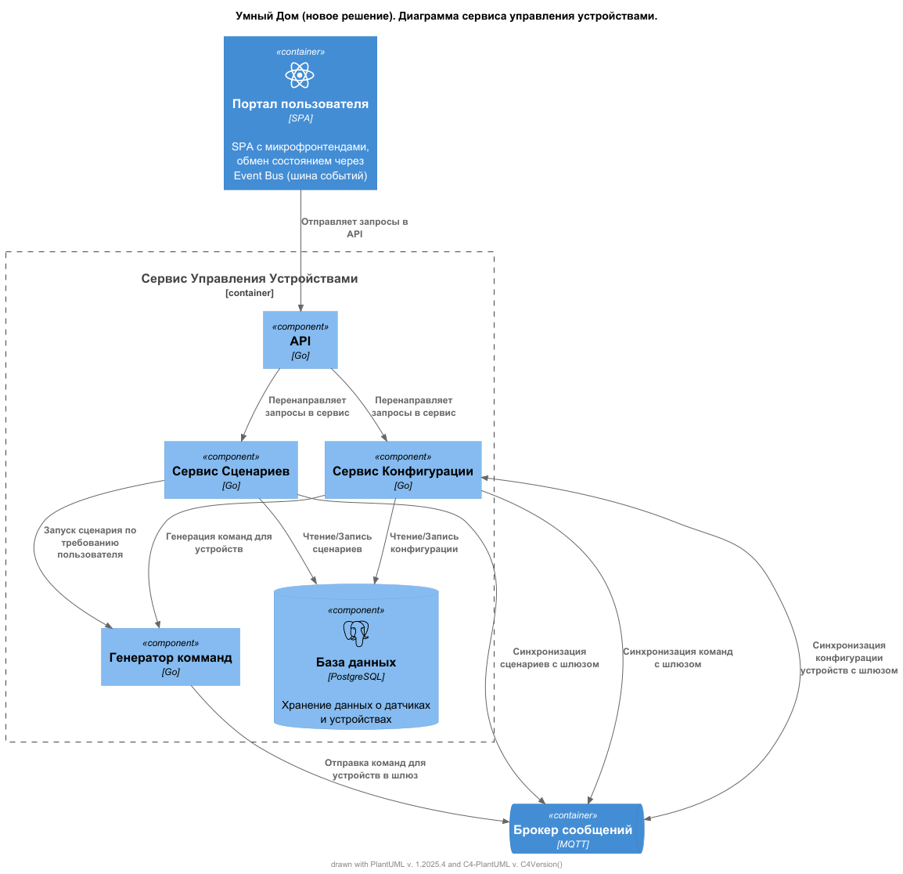
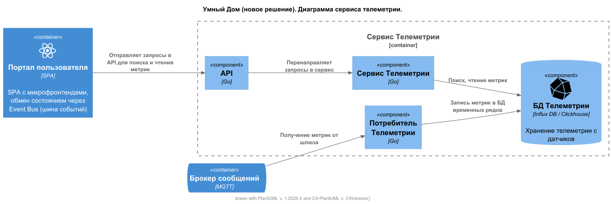
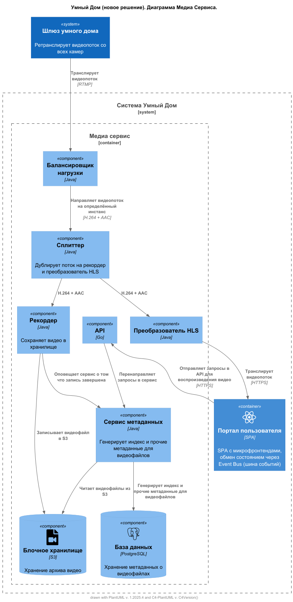
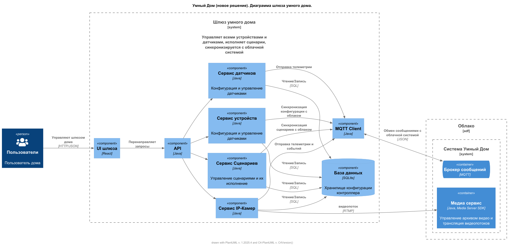
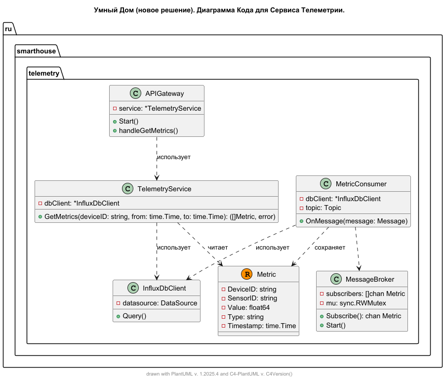

# Project_template

Это шаблон для решения проектной работы. Структура этого файла повторяет структуру заданий. Заполняйте его по мере работы над решением.

# Задание 1. Анализ и планирование

### 1. Описание функциональности монолитного приложения



Судя по имеющейся диаграмме, система управления теплым домом состоит из центрального сервера, предположительно установленного в дата-центре Компании, который управляет всеми устройствами в домах пользователей. Из раздела "Лэндскейп компании" нам известно, что на данный момент к центральному серверу подключено 100 модулей управления отоплением. Никакой дополнительной информации про модули управления нам не известно, кроме того, что: "Всё управление идёт от сервера к датчику (тут наверное имелся в виду модуль управления). Данные о температуре также получаются через запрос от сервера к датчику." Можно предположить, что существующие модули управления не имеют иного способа управления, кроме внешних команд, получаемых от центральной системы. Датчики температуры пользователи самостоятельно подключать не могут, для этого требуется приезд специалиста, который подключит датчики к центральной системе (скорее всего вызывая API центральной системы).

В текущем решении имеются следующие возможности:

**Управление отоплением:**

Данная функциональность заявлена в ТЗ, как существующая, однако в коде текущего решения его нет: нет никакой исходящей отправки команд, событий во внешнюю систему. Возможно устройство управление отопления умеет проверять записи своего состояния в БД. Будем подразумевать, что эта функциональность как-то реализована.

- Пользователи могут удалённо включать/выключать отопление в своих домах. (Согласно описанию в ТЗ. в коде этого функционала нет)
- Система поддерживает отправку команд устройствам отопления (включение/выключение). (Согласно описанию в ТЗ. в коде этого функционала нет)


**Мониторинг температуры:**

- Пользователи могут просматривать текущую температуру в своих домах через веб-интерфейс (согласно описанию в ТЗ. в коде этого функционала нет).
- Система поддерживает регистрацию датчиков температуры, обновление их параметров и удаление
- Система поддерживает получение данных о температуре с датчиков по Id или Location
- Система поддерживает хранение исторических данных измерений температуры (включая текущую температуру)

В предоставленном коде текущего решение не обнаружено возможности назначать датчики на определённый дом пользователя. Код по отправке команд модулям управления отоплением также отсутствует. Предполагаем, что данные функции реализованы какими-то модулями или сервисами, которые нам неизвестны.

### 2. Анализ архитектуры монолитного приложения

- **Язык программирования**: Go
- **База данных**: PostgreSQL
- **Архитектура**: Монолитное REST API
- **Взаимодействие**: Синхронное, запросы обрабатываются последовательно. Вызов вспомогательных сервисов производится из основных.
- **Масштабируемость**: Ограничена, так как монолит сложно масштабировать по частям
- **Развертывание**: Требует остановки всего приложения

### 3. Определение доменов и границы контекстов

#### 3.1 Существующие домены

Анализ ТЗ и предоставленного существующего кода обнаружены следующие домены и границы контекстов:

- **Домен**: Удалённое управление отоплением в доме
  - **Поддомен**: управление датчиками температуры 
    - контекст: ведение реестра датчиков (CRUD)
    - контекст: чтение текущих данных датчиков температуры
    - контекст: хранение исторических данных измерений
  - **Поддомен**: Управление устройствами отопления (включать/выключать).  _(Согласно описанию в ТЗ это есть, но в коде этого функционала нет)_
    - контекст: ведение реестра устройств (CRUD)
    - контекст: доставка управляющих команд на устройства
- **Домен**: Обслуживание клиентов
- **Домен**: Продажи и маркетинг

#### 3.2 Домены для будущей экосистемы умных посёлков

Основываясь на перечне желаемых функций, описанных в ТЗ, можно предложить следующие домены:

- **Домен**: Управление умными устройствами в доме
  - **Поддомен**: управление датчиками различного типа (движение, температура, освещённости, контакта и т.д.)
    - контекст: ведение реестра датчиков (CRUD)
    - контекст: просмотр телеметрии
    - контекст: хранение исторических данных измерений
  - **Поддомен**: Управление устройствами (отопление, дверные и гаражные замки, освещение и т.д.
    - контекст: ведение реестра устройств (CRUD)
    - контекст: доставка управляющих команд на устройства
  - **Поддомен**: Управление сценариями работы устройств
    - контекст: процесс создания сценариев: привязка событий и условий к действиям
    - контекст: процесс исполнения сценариев: 
  - **Поддомен**: Удалённое наблюдение за домом
    - контекст: процесс конфигурации видеокамер, настройка записи по расписанию или по событию
    - контекст: простом видео-потока с камер в реальном времени
    - контекст: процесс просмотра видеозаписей
- **Домен**: Поддержка модульных комплектов умного дома
  - **Поддомен**: Установка ПО в шлюзы умного дома
  - **Поддомен**: Тестирование конфигураций комплектов умного дома, проверка новых типов устройств
- **Домен**: Обслуживание клиентов
- **Домен**: Продажи и маркетинг
  - **Поддомен**: продвижение новых модульных комплектов

### **4. Проблемы монолитного решения**

Риски, связанные с использованием монолитной архитектуры:
- Сложность масштабируемости отдельных частей приложения
- Риск нарушения целостности всей системы при внесении изменений в одном компоненте
- Ограниченная гибкость при расширении функционала

Риски, связанные с выбранным способом управление из центрального сервера:
- Канал связи между центральным сервером и модулем управления может быть прерван на неопределённое время (сбой у провайдера, пользователь не оплатил услугу вовремя, модем вышел из строя и т.п.) и тогда пользователи не смогут включать/выключать отопление в своих домах и видеть актуальную температуру. Это грозит либо перегревом, либо переохлаждением помещений, что сильно ухудшит пользовательский опыт.
- При отключении центральной системы управления все пользователи теряют возможность управлять отоплением в своих домах. Это сильно ухудшит пользовательский опыт, как и в случае прерывания связи.

### 5. Визуализация контекста системы — диаграмма С4


[Посмотрите диаграмму текущей системы](schemas/as_is_system/context/Warmhouse_Context.puml)


[Посмотрите диаграмму будущей системы](schemas/to_be_system/context/Smarthouse_Context.puml)
# Задание 2. Проектирование микросервисной архитектуры

В этом задании вам нужно предоставить только диаграммы в модели C4. Мы не просим вас отдельно описывать получившиеся микросервисы и то, как вы определили взаимодействия между компонентами To-Be системы. Если вы правильно подготовите диаграммы C4, они и так это покажут.

## 2.1 **Диаграмма контейнеров (Containers)**



[Smarthouse_Container.puml](schemas/to_be_system/containter/Smarthouse_Container.puml)

## 2.2 **Диаграмма компонентов (Components)**

Добавьте диаграмму для каждого из выделенных микросервисов.
### 2.2.1 Сервис Управления Устройствами


[Smarthouse_DeviceManagementService.puml](schemas/to_be_system/component/Smarthouse_DeviceManagementService.puml)

### 2.2.2 Сервис Телеметрии


[Smarthouse_TelemetryService.puml](schemas/to_be_system/component/Smarthouse_TelemetryService.puml)

### 2.2.3 Медиа Сервис


[Smarthouse_VideoService.puml](schemas/to_be_system/component/Smarthouse_MediaService.puml)

### 2.2.4 Шлюз умного дома


[Smarthouse_Hub.puml](schemas/to_be_system/component/Smarthouse_Hub.puml)

## 2.3 **Диаграмма кода (Code)**



[Smarthouse_TelemetryService_Code.puml](schemas/to_be_system/code/Smarthouse_TelemetryService_Code.puml)

# Задание 3. Разработка ER-диаграммы

Добавьте сюда ER-диаграмму. Она должна отражать ключевые сущности системы, их атрибуты и тип связей между ними.

# Задание 4. Создание и документирование API

### 1. Тип API

Укажите, какой тип API вы будете использовать для взаимодействия микросервисов. Объясните своё решение.

### 2. Документация API

Здесь приложите ссылки на документацию API для микросервисов, которые вы спроектировали в первой части проектной работы. Для документирования используйте Swagger/OpenAPI или AsyncAPI.

# Задание 5. Работа с docker и docker-compose

Перейдите в apps.

Там находится приложение-монолит для работы с датчиками температуры. В README.md описано как запустить решение.

Вам нужно:

1) сделать простое приложение temperature-api на любом удобном для вас языке программирования, которое при запросе /temperature?location= будет отдавать рандомное значение температуры.

Locations - название комнаты, sensorId - идентификатор названия комнаты

```
	// If no location is provided, use a default based on sensor ID
	if location == "" {
		switch sensorID {
		case "1":
			location = "Living Room"
		case "2":
			location = "Bedroom"
		case "3":
			location = "Kitchen"
		default:
			location = "Unknown"
		}
	}

	// If no sensor ID is provided, generate one based on location
	if sensorID == "" {
		switch location {
		case "Living Room":
			sensorID = "1"
		case "Bedroom":
			sensorID = "2"
		case "Kitchen":
			sensorID = "3"
		default:
			sensorID = "0"
		}
	}
```

2) Приложение следует упаковать в Docker и добавить в docker-compose. Порт по умолчанию должен быть 8081

3) Кроме того для smart_home приложения требуется база данных - добавьте в docker-compose файл настройки для запуска postgres с указанием скрипта инициализации ./smart_home/init.sql

Для проверки можно использовать Postman коллекцию smarthome-api.postman_collection.json и вызвать:

- Create Sensor
- Get All Sensors

Должно при каждом вызове отображаться разное значение температуры

Ревьюер будет проверять точно так же.


# **Задание 6. Разработка MVP**

Необходимо создать новые микросервисы и обеспечить их интеграции с существующим монолитом для плавного перехода к микросервисной архитектуре. 

### **Что нужно сделать**

1. Создайте новые микросервисы для управления телеметрией и устройствами (с простейшей логикой), которые будут интегрированы с существующим монолитным приложением. Каждый микросервис на своем ООП языке.
2. Обеспечьте взаимодействие между микросервисами и монолитом (при желании с помощью брокера сообщений), чтобы постепенно перенести функциональность из монолита в микросервисы. 

В результате у вас должны быть созданы Dockerfiles и docker-compose для запуска микросервисов. 